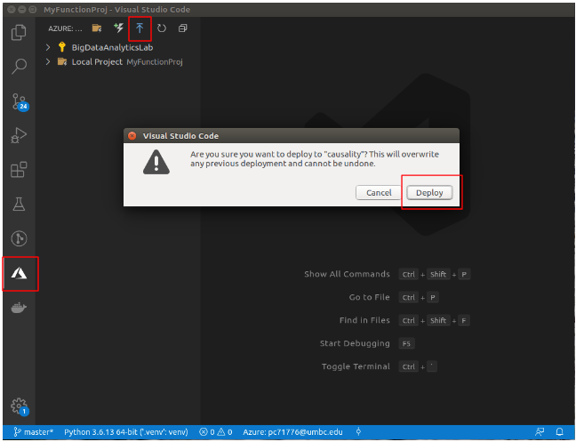

## Deploy, Analysis, and Reproduce automatically on Azure (AzureFunction)

### Prerequisites:  
Install [VScodeExtention](https://marketplace.visualstudio.com/items?itemName=ms-azuretools.vscode-azurefunctions) in VScode.

### Deploy and execute applications
1. Configuration

Use your customized configurations in each application dirctory. Also replace the *$AccountName* and *$AccountKey* in <MyFunctionProj/local.settings.json>. 

2. Deploy applications
Azure provide multiple ways to deploy your serverless functions. Here we provide an uninteractive way using VScode based on [link](https://docs.microsoft.com/en-us/azure/azure-functions/create-first-function-vs-code-python). VScode provides **one-click** way for verification and deployment of your serverless functions.
> Note: deployment root dirctory must be *MyFunctionProj*
<p align="center"></p>

3. Go to Azure [ResourceGroups](https://portal.azure.com/#blade/HubsExtension/BrowseResourceGroupBlade/resourceType/Microsoft.Resources%2Fsubscriptions%2FresourceGroups) console, navigate to your Resource Group. Create a [TemplateDeployment](https://portal.azure.com/#create/Microsoft.Template) resource by using the application template and its <./AzureFunction/Your_App/parameter.json> in each application dirctory.

4. Wait for initialization. After initialization finished, run <./AzureFunction/Your_App/app_script.sh> execution script on your local machine
```bash
bash ./AzureFunction/CausalityDiscovery/startCD.sh
```
or
```bash
bash ./AzureFunction/DomainAdaptation/startDA.sh
```

### Analysis applications
Navigate to dataExplorer tool in CosmosDB resource, and query your application outputs. Each record represents one execution of your application.
<p align="center"></p>

### Reproduce applications
Each execution record includes all reproducibility configs. Use these reproducibility configs to replace the <parameter.json> and <app_script.sh> in above steps, then submit for reproducibility.
