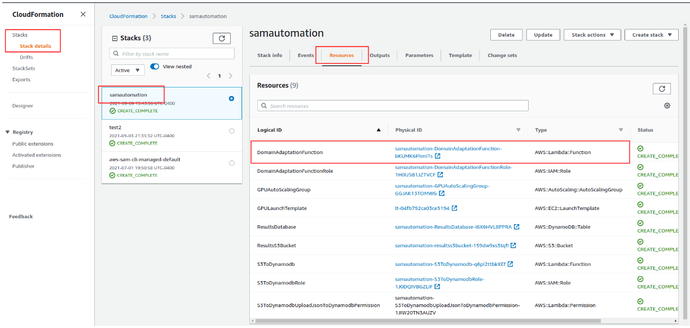
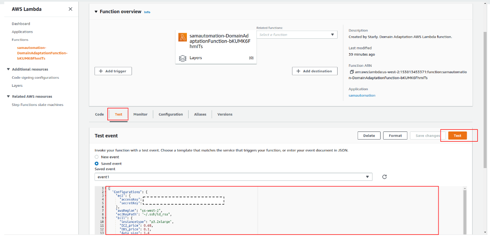
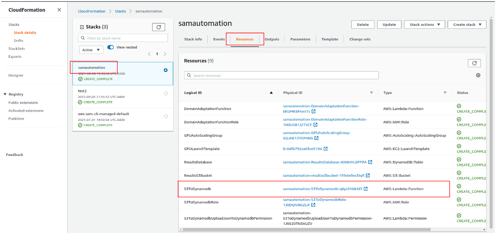

## Deploy, Analysis, and Reproduce automatically on AWS (SAMApplication)

### Prerequisites:  
Install AWS SAM CLI follow the [Step 4](https://docs.aws.amazon.com/serverless-application-model/latest/developerguide/serverless-sam-cli-install-linux.html).

### Deploy and execute applications
1. Configuration

Use your customized configurations. Replace default values in <./SAMApplication/automation.sh> and <./SAMApplication/sample_event/your_event.json>

2. Deploy applications use the terminal
```bash
cd ./SAMApplication
bash automation.sh
```

3. Go to CloudFormation console, navigate to your application stack in [stacks](https://us-west-2.console.aws.amazon.com/cloudformation/home?region=us-west-2#/stacks). 
<p align="center"></p>

4. Navigate to your application *AWS::Lambda::Function*, and submit your config event <./SAMApplication/sample_event/your_event.json> to Lambda.
<p align="center"></p>

### Analysis applications
Navigate to DynamoDB *AWS::Lambda::Function*, and query your application outputs. Each record represents one execution of your application.
<p align="center"></p>

### Reproduce applications
Each execution record includes all reproducibility configs. Use the reproducibility config as the <your_event.json> in Lambda, and submit for reproducibility.
