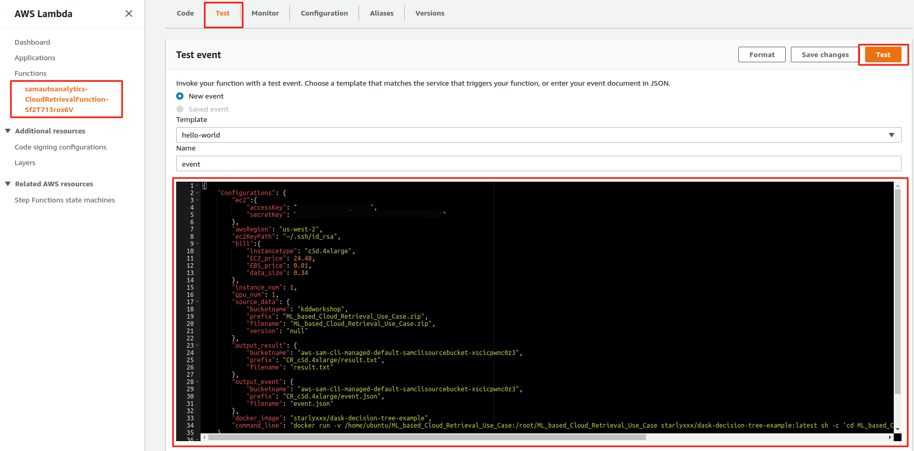
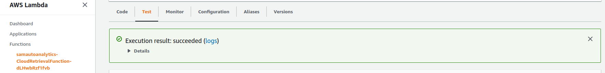
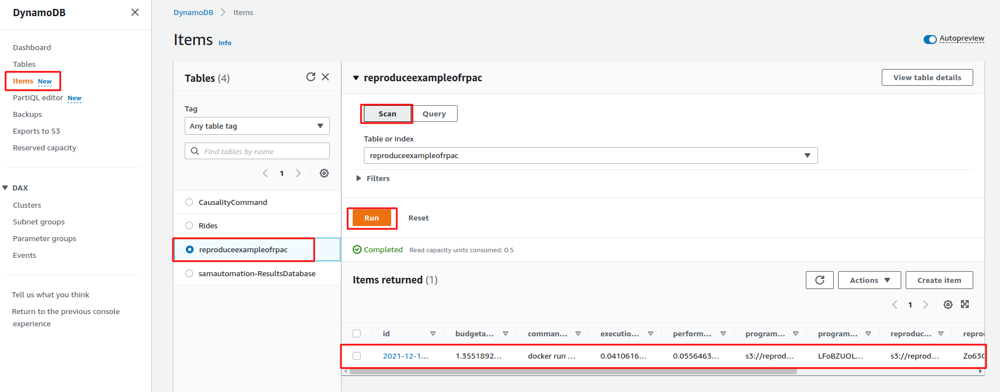
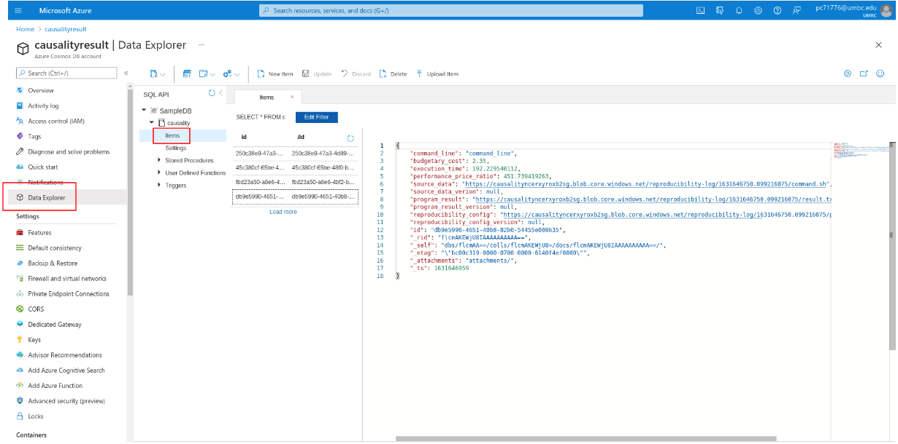

## First execution: get first execution with understanding and using RPAC toolkit

When RPAC toolkit is being utilized the first time, there is no execution history for querying and reproducing. Users need to prepare configurations to generate the pipeline file for the whole execution. 

We use CloudRetrievalViaDask application in AWS Cloud as the tutorial example.


1. Fill in three configuration files in ./ConfigTemplate folder. For personal.ini, `cloud_credentials` is formated in `credential_access_key:credential_secert_key`. 


2. Run `python3 main.py` to start RPAC for CloudRetrievalViaDask application. 

Example output:
```
-------------------------------------------------------------------------------------------------

Successfully created/updated stack - samautoanalytics in us-west-2

2021-11-29 13:32:45,098 | Sending Telemetry: {'metrics': [{'commandRun': {'requestId': 'e3fe2748-2818-46c5-84d2-b445f5e30ea3', 'installationId': '30e2028a-1307-4162-b381-0bdaec1cfb5a', 'sessionId': 'b145d6ba-98a7-4a13-80fc-ca3ce0251d43', 'executionEnvironment': 'CLI', 'ci': False, 'pyversion': '3.7.10', 'samcliVersion': '1.24.1', 'awsProfileProvided': False, 'debugFlagProvided': True, 'region': '', 'commandName': 'sam deploy', 'duration': 101240, 'exitReason': 'success', 'exitCode': 0}}]}

```

> Note: for the tutorial, we separate cloud provisioning with analytics execution. This step will only finish software and hardware provisioning of analytics automatically.


3. Send the [analytics execution event](./AwsServerlessTemplate/CloudRetrievalViaDask/SampleEvent.json) via CloudRetrievalFunction AWS::Lambda::Function. Wait for stutas until `Execution result: succeeded`.

The AWS::Lambda::Function resource url can be find at [AWS Lambda service](https://us-west-2.console.aws.amazon.com/lambda/home?region=us-west-2#/functions). Submit your event from Lambda.

<p align="center"></p>
<p align="center"></p>


4. All analytics is done now. Users are able to scan and query execution history in [AWS Dynamodb](https://us-west-2.console.aws.amazon.com/dynamodbv2/home?region=us-west-2#item-explorer).

<p align="center"></p>

> Note: here we also provide [Azure Cosmosdb](https://portal.azure.com/#@umbc.onmicrosoft.com/resource/subscriptions/250c38e9-47a3-4d89-bc68-54155a7fe08e/resourcegroups/StartlyResource/providers/Microsoft.DocumentDB/databaseAccounts/causalityresult/dataExplorer) output as reference.

<p align="center"></p>


5. Terminate RPAC. Delete the stack just created in [https://us-west-2.console.aws.amazon.com/cloudformation/home?region=us-west-2](https://us-west-2.console.aws.amazon.com/cloudformation/home?region=us-west-2).
