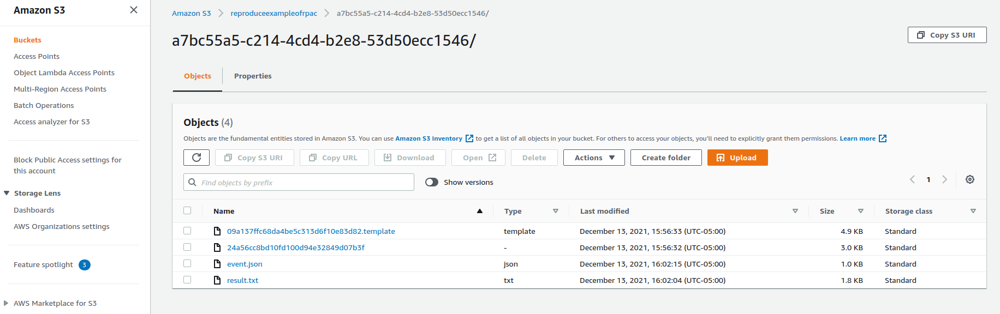

## Reproduce: reproduce existing execution with RPAC

The [reproduce](../reproduce) folder includes the pipeline file that generated by RPAC. RPAC toolkit will execute big data analytics in cloud based on all files in this folder.

We use CloudRetrievalViaDask application in AWS Cloud as the tutorial example.

After an application has been executed, clients can reproduce it with its execution history. We put an example in our public S3 bucket `s3://reproduceexampleofrpac`. Our RPAC toolkit helps the client generate a pipeline file based on their preferences. 

> For example, in execution history as the figure shown, users enable to retrieval the source dataset, command line, pipeline file and execution events (reproducibility_config) from recorded storage addresses (scroll down to find more attributes.).

1. Follow the address in execution history as shown in the figure, download all execution history files from storage folder (s3://reproduceexampleofrpac/a7bc55a5-c214-4cd4-b2e8-53d50ecc1546/). 

2. Replace tamplate files in `./AwsServerlessTemplate/CloudRetrievalViaDask` folder with the downloaded files. For example: 

   - The lambda unzip folder (like "24a56cc8bd10fd100d94e32849d07b3f") -> ./AwsServerlessTemplate/CloudRetrievalViaDask/lambda
   - The pipline file (like "09a137ffc68da4be5c313d6f10e83d82.template") -> ./AwsServerlessTemplate/CloudRetrievalViaDask/deploy_config.json
   - The execution event file (like "event.json") -> ./AwsServerlessTemplate/CloudRetrievalViaDask/SampleEvent.json

3. Also provide user personal information in `./ConfigTemplate/personal.ini`. If user want to reproduce execution with different application or resource configurations, please also edit `./ConfigTemplate/application.ini` and `./ConfigTemplate/resource.ini`.

4. Run `python3 main.py` to start RPAC for reproduction. With user-provided personal information and historical execution, a new pipeline will be generated in `./reproduce` folder.
